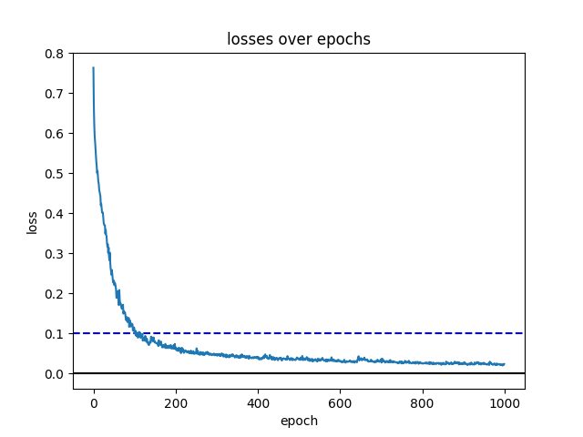

# Pattern Analysis
Pattern Analysis of various datasets by COMP3710 students in 2025 at the University of Queensland.

We create pattern recognition and image processing library for Tensorflow (TF), PyTorch or JAX.

This library is created and maintained by The University of Queensland [COMP3710](https://my.uq.edu.au/programs-courses/course.html?course_code=comp3710) students.

The library includes the following implemented in Tensorflow:
* fractals 
* recognition problems

In the recognition folder, you will find many recognition problems solved including:
* segmentation
* classification
* graph neural networks
* StyleGAN
* Stable diffusion
* transformers
etc.

## COMP3710 s4801908 project 1 
Segment the 2D OASIS brain data set with an Improved UNet [1] or 2D CAN [2] with all labels having a minimum Dice similarity coefficient of 0.9 on the test set. [Easy Difficulty]

algorithm: Improved UNet for image segmentsation
problem: segment 2D OASIS brain scans

# Architecture
the dataset consists of a image and a segmentation image that acts as the image mask.
these are used in a Unet model that consists of 3 convolution blocks for both encoder, decoder.
the Unet takes in a batch_sizex1x256x256 image and outputs batch_sizex4x256x256 probability

unlike autoencoder, each encoder convolution block can pass on data to a coresponding decoder convolution block. 
this is performed via the 
'''
nn.Upsample()
'''
this Unet performs a sematic segmentation. categorising a pixel as a specific class. 

### convolution block
each colvolution block consists of 2 convolution layers.
consisting of a leakyReLu activation function. dropout function is use to remove features and prevent overreliance on a few features. along with batchnorm and a 2d convolution

### loss function
a multiclass dice loss function is used.
Which uses a different matrices for each class to generate multiple dice coeff then determining their mean to determine the loss value.

$$dice coeffic = \frac{2*|A\cap B|}{|A|+|B|}$$

### Hyper parameter
this is then trained with epochs 1000
and learning rate of 0.0008
batch size of 16

# OASIS brain data
### Input
from the 2D OASIS brain data and input image and mask where collected. 
''from png labeled slices and seg. ''
the mask image ranges from 0-255 is convert to a array ranging from 0-3
the image pile is a 256x256 grayscale the was normalise to a mean of 0 and standard deviation of 1
'display mask after processing'

only data from the train dataset was used as inputs for the unet
### Output
outputs a 256x256 TODO double check>> with 4 channel. this is compared with a dice loss function to determine loss.  

the outputs have a degrees of randomness. this is particalue due to some randomness in the 'adam optimiser' and datasetloader

### Results
the avgerage dice loss value lowers 

the model perfromance on test dataset

dice loss per class

all class have a dice loss under 0.10, thus their have a dice coefficent over 0.9.

# Dependencies
scikit-learn 1.7.1
matplotlib 3.10.0
numpy 2.3.2
torch 2.8
torchmetric 1.8.
PIL 11.1.0

# References

https://colab.research.google.com/drive/1VOsZSyRhyuHLmgoqGriQk01ub4bKNmZ1?usp=sharing#scrollTo=23402ec0

https://github.com/shakes76/PatternAnalysis-2024/pull/90

https://github.com/shakes76/PatternAnalysis-2024/pull/113

https://github.com/shakes76/PatternAnalysis-2024/pull/178

https://github.com/shakes76/PatternAnalysis-2024/pull/138

